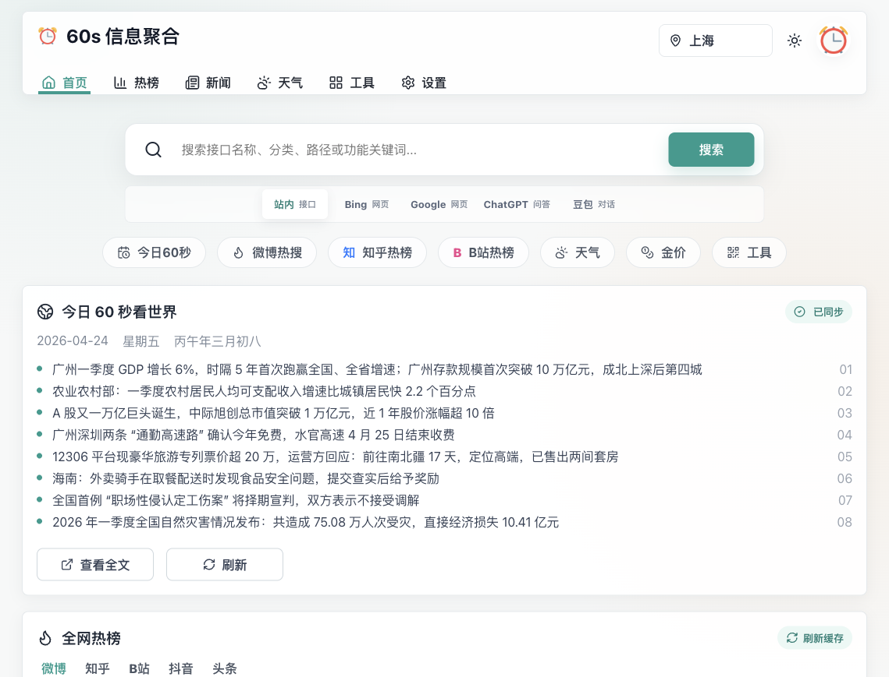

# 60s-web

`60s-web` 是一个面向个人首页、自部署信息面板和轻量导航场景的 Web 应用。项目基于 [vikiboss/60s](https://github.com/vikiboss/60s) 提供的数据接口，将每日简报、热榜、天气、实用数据和常用工具聚合到一个可长期使用的浏览器首页中。

> 前端仓库：[`dogxii/60s-web`](https://github.com/dogxii/60s-web)  
> API 项目：[`vikiboss/60s`](https://github.com/vikiboss/60s)



## 功能概览

- **每日信息**：今日 60 秒简报、历史信息、AI/IT 资讯入口
- **全网热榜**：微博、知乎、B 站、抖音、头条等榜单聚合
- **天气中心**：城市实时天气、空气质量、未来天气趋势
- **实用数据**：金价、油价、汇率、节假日倒计时等信息卡片
- **娱乐信息**：电影票房、Epic 免费游戏等轻量内容
- **工具中心**：翻译、二维码、密码生成、配色方案、接口实验室
- **导航搜索**：支持站内接口搜索，并可跳转 Bing、Google、ChatGPT、豆包
- **个性化设置**：默认城市、API 地址、模块开关、缓存刷新、头像、壁纸、外壳主题
- **部署友好**：支持 Vercel、Cloudflare Pages、Docker、Nginx 静态部署

## 技术栈

| 类别 | 选型 |
| --- | --- |
| Runtime / 包管理 | Bun |
| 构建工具 | Vite |
| 前端框架 | React 19 |
| 语言 | TypeScript |
| 图标 | lucide-react |
| 数据来源 | vikiboss/60s API |

## 快速开始

```bash
bun install
bun run dev
```

开发服务默认监听 `0.0.0.0`，通常可通过以下地址访问：

```text
http://localhost:5173
```

生产构建：

```bash
bun run build
```

本地预览生产构建：

```bash
bun run preview
```

## API 配置

应用默认 API 地址为：

```text
https://60s.viki.moe/v2
```

你可以在页面的 `设置 -> 默认 API` 中替换为自托管的 60s API 地址。该配置保存在浏览器本地，不依赖后端数据库。

如果需要了解接口能力、部署 API 服务或参与接口项目开发，请查看上游仓库：

```text
https://github.com/vikiboss/60s
```

## 部署到 Vercel

### 通过 GitHub 导入

1. 将项目推送到 GitHub，例如 `dogxii/60s-web`
2. 登录 Vercel，点击 `Add New... -> Project`
3. 选择该 GitHub 仓库并导入
4. 使用以下构建配置：

```text
Framework Preset: Vite
Install Command: bun install
Build Command: bun run build
Output Directory: dist
```

项目已提供 `vercel.json`：

```json
{
  "buildCommand": "bun run build",
  "outputDirectory": "dist",
  "installCommand": "bun install",
  "framework": "vite",
  "rewrites": [{ "source": "/(.*)", "destination": "/index.html" }]
}
```

### 通过 Vercel CLI

```bash
bunx vercel
```

部署到生产环境：

```bash
bunx vercel --prod
```

## 部署到 Cloudflare Pages

1. 打开 Cloudflare Dashboard
2. 进入 `Workers & Pages -> Create application -> Pages`
3. 连接 GitHub 仓库 `dogxii/60s-web`
4. 使用以下构建配置：

```text
Framework preset: Vite
Build command: bun run build
Build output directory: dist
Root directory: /
```

建议在环境变量中指定 Bun 版本：

```text
BUN_VERSION=1.1.0
```

如果当前 Cloudflare Pages 环境未启用 Bun，也可以使用 npm 构建：

```text
Build command: npm install && npm run build
Build output directory: dist
```

## Docker 部署

构建镜像：

```bash
docker build -t 60s-web .
```

运行容器：

```bash
docker run -d --name 60s-web -p 8080:80 60s-web
```

访问：

```text
http://localhost:8080
```

## Docker Compose

```yaml
services:
  60s-web:
    image: 60s-web
    build: .
    ports:
      - "8080:80"
    restart: unless-stopped
```

启动：

```bash
docker compose up -d
```

## Nginx 静态部署

先生成静态文件：

```bash
bun install
bun run build
```

将 `dist/` 目录部署到服务器，并配置 SPA fallback：

```nginx
server {
  listen 80;
  server_name example.com;

  root /var/www/60s-web/dist;
  index index.html;

  location / {
    try_files $uri $uri/ /index.html;
  }
}
```

## 目录结构

```text
.
├── docs/                 # README 截图等文档资源
├── public/               # favicon 等静态资源
├── src/                  # 应用源码
├── Dockerfile            # Docker 镜像构建
├── nginx.conf            # 容器内 Nginx 配置
├── vercel.json           # Vercel 部署配置
└── vite.config.ts        # Vite 配置
```

## 适用场景

- 浏览器默认首页
- 自部署信息聚合面板
- 60s API 的可视化前端
- 轻量导航页
- 个人服务器或家庭网络的信息入口

## 致谢

数据接口由 [vikiboss/60s](https://github.com/vikiboss/60s) 提供。本项目主要负责前端展示、个性化设置和部署体验。

## License

请根据实际发布计划补充许可证文件。
